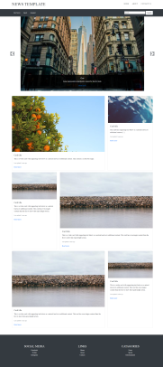
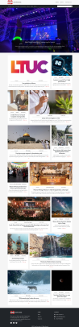

# **News Box Project**

>**Overview :** App that give the users an easy access to various categories of news or search for any keywords they want to know the news about it.

## **Team Members:**
- Fahad Zidan **(Team leader)**
- Ahmad Jubran
- Qais Alsghe
- Suhaib Alnaji
- Sadrah Alsabagh
- Abdallah Smadi
- Wlla Talafha

---

## **Technologies Used:**
1. React

2. React-Bootstrap

3. Express

4. NodeJs

5. MongoDB

6. MongoDB Atlas

7. CRUD

8. NPM libraries

9. CSS

10. API

11. State and props

12. Cache memory

13. Auth0

---
## **Description:**
A fully functional CRUD app that shows the news in different categories or based on the user search. the admins only have the ability to update, edit ,or delete some data.  

---

## **Wireframe:**

- **the app template (fully HTML and CSS only):**

    

- **Home page**

    

- **Contact us page**

    

- **About us page**

    

- **Admin page**

    

---

## **Domain Modeling:**

Ther are two sources for the data:
- Third party API
- Mongo database

    

---

## **Stories:**

**User story:**

As a user I want to read news:
- all users can see all news.
- all users can choose the news category.
- all users can search for the news with any keyword he wants.

acceptance tests:

- provide easy way to move throw the site.
- provide good response to the filteration orders the user makes.
- provide the correct data when users write a specific keyword for search or choose a specific category.

**Admin story:**

As an Admin:
- Only the admins can log in to the app.
- Admins can make a review.
- Admins can add, edit, or delete news.

acceptance tests:

- provide easy way to move throw the site.
- provide an easy way to organize the news whether delete, edit or add it.

---

## **Final Result**

 

 
 
 
  
 

 ---

## **Deploy url:**

 https://news-box-project.netlify.app/
